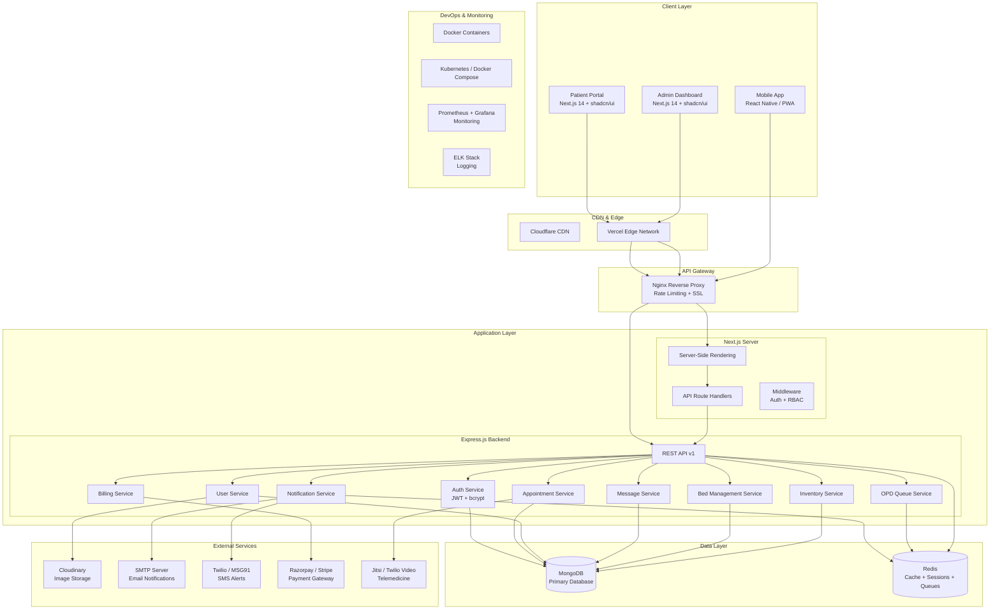
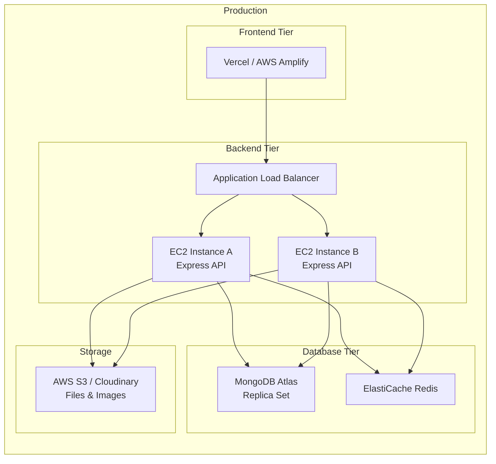
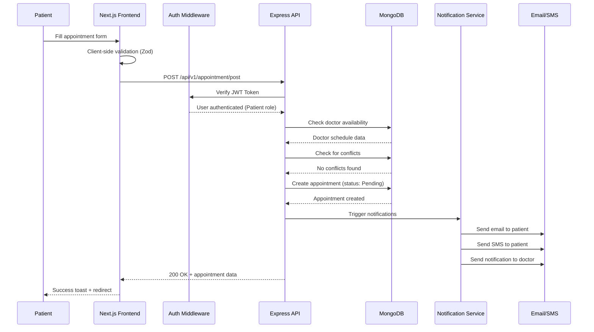

# ZeeCare Hospital Management System — Architecture Diagram

## High-Level System Architecture

## Deployment Architecture

## Request Flow (Appointment Booking)

## Role-Based Access Control (RBAC)

```mermaid
graph TB
    subgraph "Roles"
        ADMIN[Admin]
        DOC[Doctor]
        PAT[Patient]
        SUPER[Super Admin]
    end

    subgraph "Admin Permissions"
        A1[Manage Doctors]
        A2[Manage Appointments]
        A3[View Messages]
        A4[Add Admin]
        A5[Manage Beds & Wards]
        A6[Manage Inventory]
        A7[View Analytics]
        A8[Manage Billing]
        A9[System Settings]
    end

    subgraph "Doctor Permissions"
        D1[View Own Schedule]
        D2[Accept/Reject Appointments]
        D3[Manage Consulting Hours]
        D4[Write Prescriptions]
        D5[View Patient Records]
        D6[Start Telemedicine Call]
        D7[Update OPD Status]
        D8[Order Lab Tests]
    end

    subgraph "Patient Permissions"
        P1[Book Appointment]
        P2[Book OPD Slot]
        P3[View Own Profile]
        P4[View Health Records]
        P5[Send Message]
        P6[Rate Doctors]
        P7[Join Telemedicine Call]
        P8[View Billing & Payments]
        P9[Download Prescriptions]
    end

    SUPER --> ADMIN
    ADMIN --> A1 & A2 & A3 & A4 & A5 & A6 & A7 & A8 & A9
    DOC --> D1 & D2 & D3 & D4 & D5 & D6 & D7 & D8
    PAT --> P1 & P2 & P3 & P4 & P5 & P6 & P7 & P8 & P9
```

